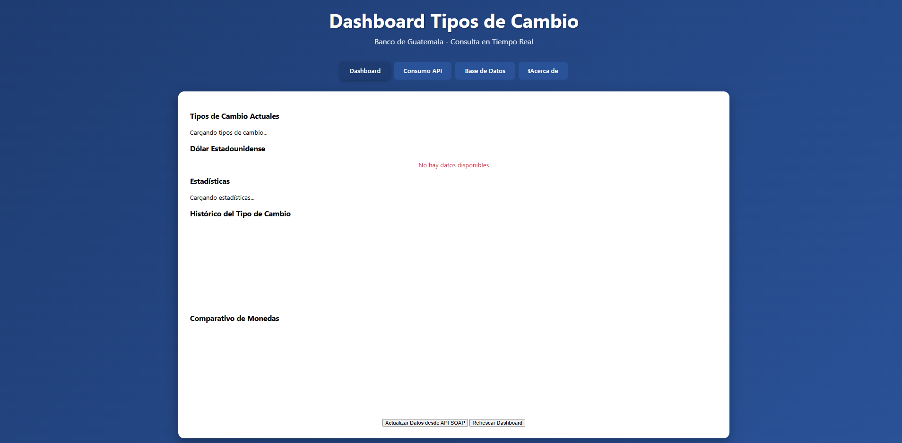
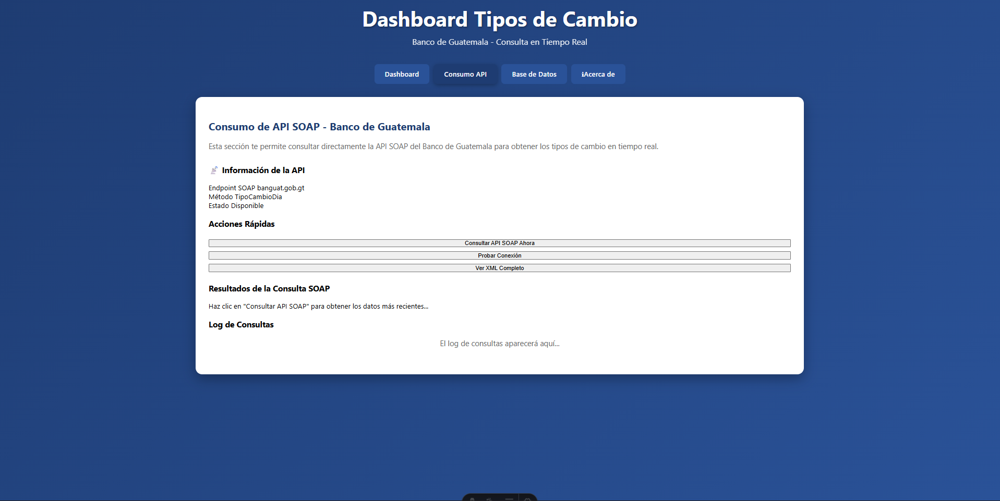
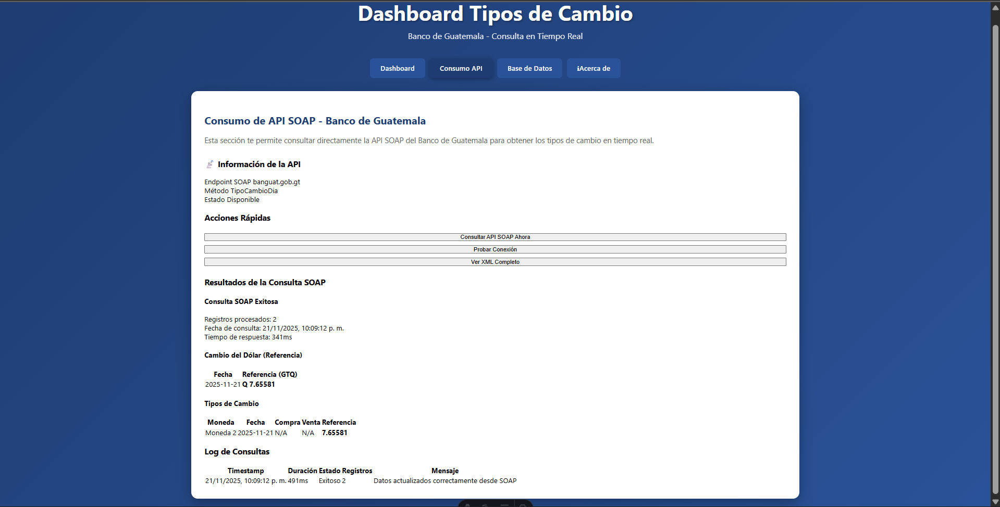
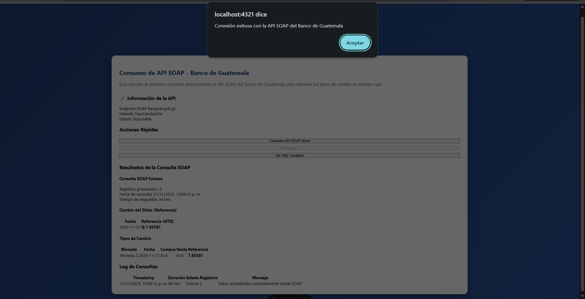
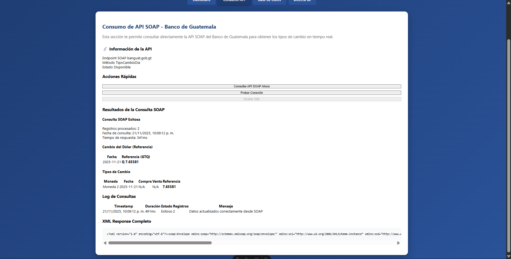
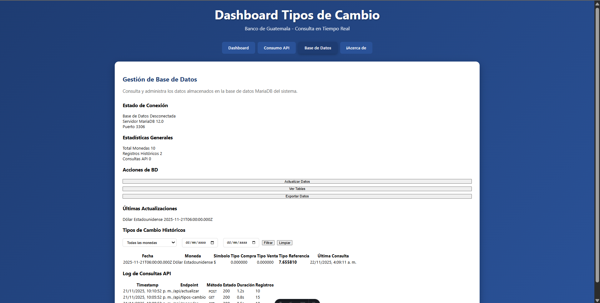
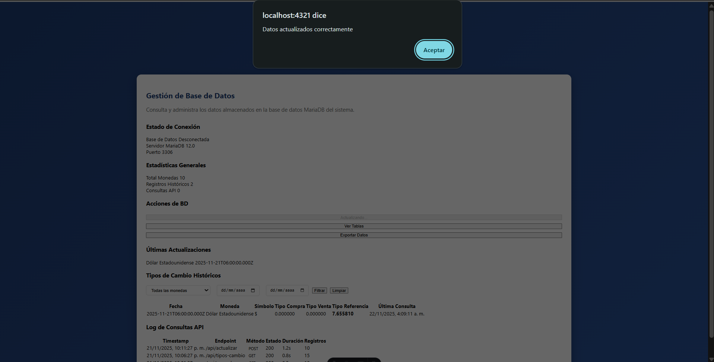
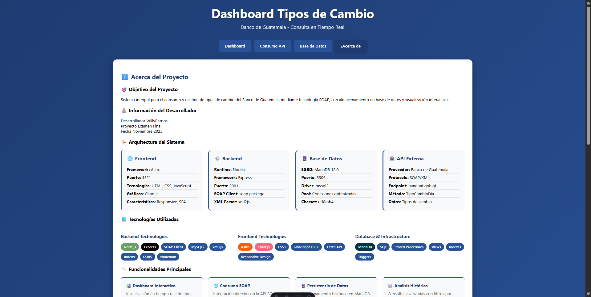

# Frontend - Consumidor de API SOAP del Banco de Guatemala

Aplicación frontend desarrollada con Astro para consultar y visualizar los tipos de cambio del Banco de Guatemala mediante su API SOAP.

## � Descripción

Esta aplicación web consume la API SOAP del Banco de Guatemala para obtener información actualizada sobre tipos de cambio de diferentes monedas. Los datos se almacenan en una base de datos MariaDB a través de un backend API REST y se visualizan de manera interactiva con gráficos y tablas.

## 🛠️ Tecnologías Utilizadas

### Frontend
- **Astro** - Framework web moderno para construcción de sitios estáticos y dinámicos
- **JavaScript (Vanilla)** - Lógica del cliente sin frameworks adicionales
- **Chart.js** - Biblioteca para visualización de datos en gráficos
- **CSS3** - Estilos y diseño responsivo

### Backend (Requerido)
- **Node.js + Express** - API REST en puerto 3001
- **MariaDB** - Base de datos relacional
- **SOAP Client** - Cliente para consumir el servicio SOAP del Banco de Guatemala

## 📦 Instalación

### Prerrequisitos

1. **Node.js** (versión 18 o superior)
2. **Backend API** corriendo en `http://localhost:3001`
3. **Base de datos MariaDB** configurada

### Pasos de Instalación

1. Clonar el repositorio:
```sh
git clone https://github.com/WillyBarrios/frontend_api_consumer_ExamenF.git
cd frontend_api_consumer_ExamenF
```

2. Instalar dependencias:
```sh
npm install
```

3. Verificar que el backend API esté corriendo en el puerto 3001

4. Iniciar el servidor de desarrollo:
```sh
npm run dev
```

5. Abrir el navegador en `http://localhost:4321`

## 🚀 Comandos Disponibles

| Comando                   | Acción                                              |
| :------------------------ | :-------------------------------------------------- |
| `npm install`             | Instala las dependencias del proyecto               |
| `npm run dev`             | Inicia el servidor de desarrollo en `localhost:4321`|
| `npm run build`           | Construye el sitio para producción en `./dist/`     |
| `npm run preview`         | Previsualiza la build de producción localmente      |
| `npm run astro ...`       | Ejecuta comandos CLI de Astro                       |

## 🔌 Consumo de la API

### Arquitectura de Consumo

```
[Frontend Astro] ←→ [Backend API REST] ←→ [API SOAP Banguat]
                           ↕
                     [MariaDB]
```

### Endpoints Utilizados

El frontend consume los siguientes endpoints del backend:

1. **GET `/api/tipos-cambio`**
   - Obtiene el historial de tipos de cambio almacenados en la base de datos
   - Parámetros opcionales: `moneda`, `fechaDesde`, `fechaHasta`, `limit`

2. **GET `/api/dolar`**
   - Obtiene información específica del tipo de cambio del dólar estadounidense

3. **GET `/api/estadisticas`**
   - Retorna estadísticas generales del sistema (total de monedas, registros, última actualización)

4. **GET `/api/monedas`**
   - Obtiene el catálogo completo de monedas disponibles

5. **POST `/api/actualizar`**
   - Solicita una actualización de datos consultando directamente la API SOAP del Banco de Guatemala
   - Procesa y almacena los nuevos datos en la base de datos

6. **GET `/health`**
   - Verifica el estado de la conexión del backend con la base de datos y la API SOAP

### Flujo de Datos

1. **Consulta Directa SOAP** (Página: Consumo API)
   - El usuario puede consultar directamente la API SOAP
   - Los datos se procesan y se almacenan en la base de datos a través del backend
   - Se visualiza el XML completo de la respuesta SOAP

2. **Visualización de Datos** (Página: Dashboard)
   - Se consultan los datos almacenados en la base de datos
   - Se generan gráficos interactivos con Chart.js
   - Actualización automática cada 5 minutos

3. **Gestión de Base de Datos** (Página: Base de Datos)
   - Consulta y filtrado de registros históricos
   - Visualización del estado de las tablas
   - Estadísticas en tiempo real

### API SOAP del Banco de Guatemala

**Endpoint**: `https://www.banguat.gob.gt/variables/ws/TipoCambio.asmx`

**Método SOAP**: `TipoCambioDia`

**Respuesta**: XML con información de:
- Tipos de cambio de múltiples monedas
- Tipo de compra, venta y referencia
- Fecha de la consulta
- Catálogo de monedas disponibles

## 📁 Estructura del Proyecto

```text
/
├── public/              # Archivos estáticos
├── src/
│   ├── layouts/
│   │   └── Layout.astro # Layout principal con navegación
│   └── pages/
│       ├── index.astro  # Dashboard principal
│       ├── api-soap.astro    # Consumo directo de API SOAP
│       ├── base-datos.astro  # Gestión de base de datos
│       └── about.astro       # Acerca de
├── package.json
└── README.md
```

## 🎨 Características

- ✅ Dashboard interactivo con gráficos en tiempo real
- ✅ Consumo directo de API SOAP del Banco de Guatemala
- ✅ Visualización de XML completo de respuestas SOAP
- ✅ Gestión y filtrado de datos históricos
- ✅ Diseño responsivo y moderno
- ✅ Actualización automática de datos
- ✅ Manejo de errores y estados de carga

## 🔧 Configuración

El frontend está configurado para conectarse al backend en:
- **URL Base**: `http://localhost:3001/api`

Si necesitas cambiar esta URL, edita la constante `API_BASE` en cada archivo de página:

```javascript
const API_BASE = 'http://localhost:3001/api';
```

## 📝 Notas Importantes

- El backend debe estar corriendo antes de iniciar el frontend
- La base de datos MariaDB debe estar configurada y accesible
- La API SOAP del Banco de Guatemala debe estar disponible para consultas en tiempo real
- Se recomienda Node.js v18 o superior para compatibilidad con Astro

## 📄 Licencia

Este proyecto es de código abierto y está disponible bajo la licencia MIT.

## 👨‍💻 Autor

Willy Barrios









